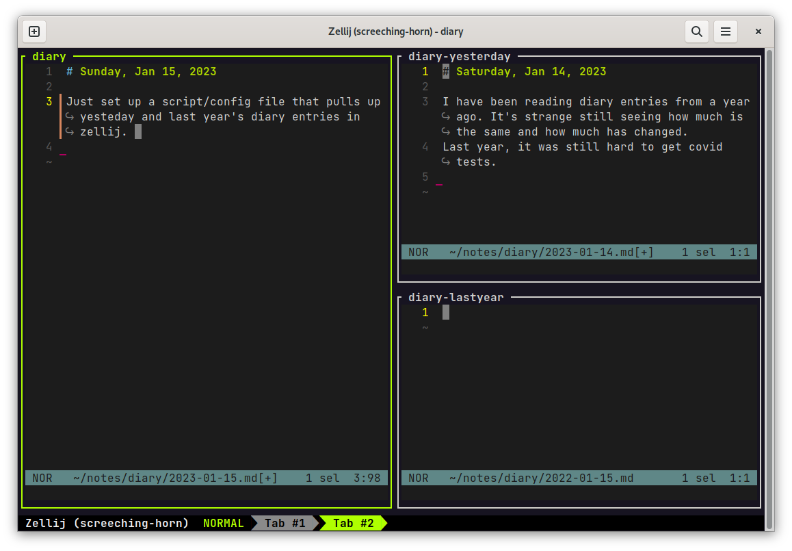

I do a quick brain dump at the beginning of the day. Things I'm thinking about, things that are happening, the weather, how I got to work that day, things to do. It's usually short and in plain text.

I don't often look back at these notes, but when I do, it's interesting and funny. Looking at yesterday's is useful to see if what I completed or am still working on. Looking at last year's is usually entertaining to see that I'm still worrying about the same things. (How my dog is pooping is a reoccuring theme)

Since I'm testing out zellij as a tmux replacement, I whipped up a quick layout and script to start a new diary entry and pull up what I wrote from yesterday and last year. I call it: Dear Diary (`ddiary` for short)

## Parts:

- Bash script that opens the editor to a diary entry for today. It creates a new one if it doesn't exist yet.
  - Scripts to open diary entries for yesterday and last year.
- Zellij layout that opens panes with today, yesterday, and last year, using the above scripts.
- Bash script that opens the dear diary layout in Zellij. It detects if it's in a Zellij session already and opens in a new tab if so.
